# [Tansoftware](https://www.tansoftware.com) - Fonctionnement d'un compilateur [](https://raw.githubusercontent.com/gosquared/flags/master/flags/flags/shiny/24/France.png)


# Table des matières

-   [Introduction](#introduction)
-   [Analyse lexicale](#analyse-lexicale)
-   [Analyse syntaxique](#analyse-syntaxique)
-   [Analyse sémantique](#analyse-s%C3%A9mantique)
-   [Génération de code intermédiaire](#g%C3%A9n%C3%A9ration-de-code-interm%C3%A9diaire)
-   [Optimisation du code](#optimisation-du-code)
-   [Génération du code binaire](#g%C3%A9n%C3%A9ration-du-code-binaire)
-   [Les compilateurs modernes](#les-compilateurs-modernes)


# Introduction

Un compilateur est un programme qui traduit le code source écrit dans un langage de programmation en code binaire qui peut être exécuté par un ordinateur. 

Le processus de compilation suit un flux général similaire pour tous les langages de programmation, mais certaines étapes peuvent varier en fonction des caractéristiques spécifiques du langage de programmation pour lequel le compilateur est conçu.

En outre, bien que d'autres processus interviennent dans ce principe, comme par exemple les tests, la compilation permet également de détecter les erreurs de syntaxe et d'autres problèmes dans le code source avant que le programme ne soit exécuté.

[🔝 Retour en haut de page](#table-des-matières)


## Analyse lexicale

L'analyse lexicale est la première étape du processus de compilation d'un programme. Cette étape consiste à analyser le code source et à le diviser en unités lexicales, appelées tokens. Les tokens représentent les éléments de base du langage de programmation, comme les mots clés, les identificateurs, les symboles, les nombres, les chaînes de caractères, etc.

Le schéma suivant illustre le processus d'analyse lexicale :

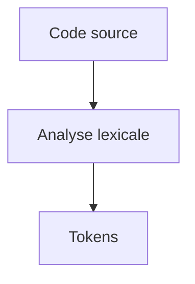

Le processus d'analyse lexicale se déroule en plusieurs étapes :

1. **Lecture du code source** : le compilateur lit le code source caractère par caractère.

2. **Identification des lexèmes** : le compilateur identifie chaque lexème (unité lexicale) du code source. Les lexèmes peuvent être des mots clés, des identificateurs, des symboles, des nombres, des chaînes de caractères, etc.

3. **Attribution des types de tokens** : le compilateur associe chaque lexème à un type de token correspondant. Les types de tokens représentent les éléments de base du langage de programmation, comme les mots clés, les identificateurs, les symboles, etc.

4. **Création de la table des symboles** : le compilateur crée une table des symboles qui répertorie tous les identificateurs rencontrés dans le code source.

5. **Génération des tokens** : le compilateur génère une séquence de tokens qui représente le code source.


[🔝 Retour en haut de page](#table-des-matières)


## Analyse syntaxique

Une fois que l'analyse lexicale est terminée, le compilateur passe à la deuxième étape du processus de compilation : l'analyse syntaxique. Cette étape consiste à vérifier si la structure du code source est conforme aux règles syntaxiques du langage de programmation. L'analyse syntaxique utilise les tokens générés lors de l'analyse lexicale pour construire un arbre syntaxique qui représente la structure du code source.

Le schéma suivant illustre le processus d'analyse syntaxique :

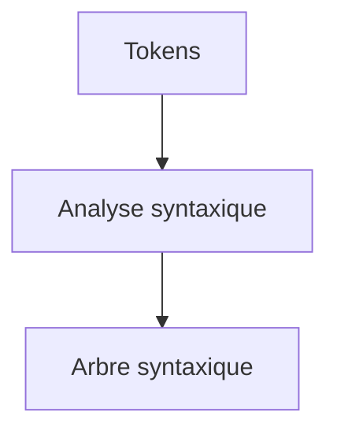

Le processus d'analyse syntaxique se déroule en plusieurs étapes :

1. **Analyse de la grammaire** : le compilateur utilise la grammaire du langage de programmation pour déterminer la structure syntaxique correcte du code source.

2. **Construction de l'arbre syntaxique** : le compilateur construit un arbre syntaxique qui représente la structure du code source en utilisant les tokens générés lors de l'analyse lexicale.

3. **Vérification de la conformité syntaxique** : le compilateur vérifie si l'arbre syntaxique respecte les règles syntaxiques du langage de programmation.

4. **Génération du code intermédiaire** : le compilateur génère du code intermédiaire qui représente le code source sous une forme plus facile à manipuler pour les étapes suivantes du processus de compilation.

[🔝 Retour en haut de page](#table-des-matières)


## Analyse sémantique

Une fois que l'analyse syntaxique est terminée, le compilateur passe à l'étape d'analyse sémantique. Cette étape consiste à vérifier si le code source respecte les règles sémantiques du langage de programmation. L'analyse sémantique utilise les informations de type et de portée fournies par l'analyse syntaxique pour vérifier si les opérations effectuées sur les variables et les expressions sont valides.

Le schéma suivant illustre le processus d'analyse sémantique :

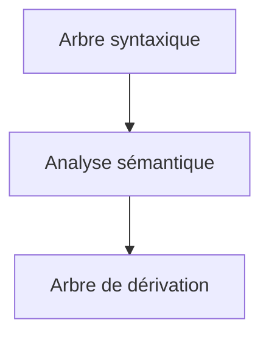

Le processus d'analyse sémantique se déroule en plusieurs étapes :

1. **Vérification de la déclaration des variables** : le compilateur vérifie si toutes les variables sont correctement déclarées et si elles sont utilisées de manière appropriée dans le code source.

2. **Vérification de la cohérence des types** : le compilateur vérifie si les opérations effectuées sur les variables et les expressions sont conformes aux règles de typage du langage de programmation.

3. **Attribution des adresses mémoire** : le compilateur attribue des adresses mémoire aux variables et aux constantes déclarées dans le code source.

4. **Génération de l'arbre de dérivation** : le compilateur génère un arbre de dérivation qui représente la structure sémantique du code source.

[🔝 Retour en haut de page](#table-des-matières)


## Génération de code intermédiaire

Une fois que l'analyse syntaxique est terminée, le compilateur passe à l'étape de génération de code intermédiaire. Cette étape consiste à générer du code intermédiaire qui représente le code source sous une forme plus facile à manipuler pour les étapes suivantes du processus de compilation.

Le schéma suivant illustre le processus de génération de code intermédiaire :

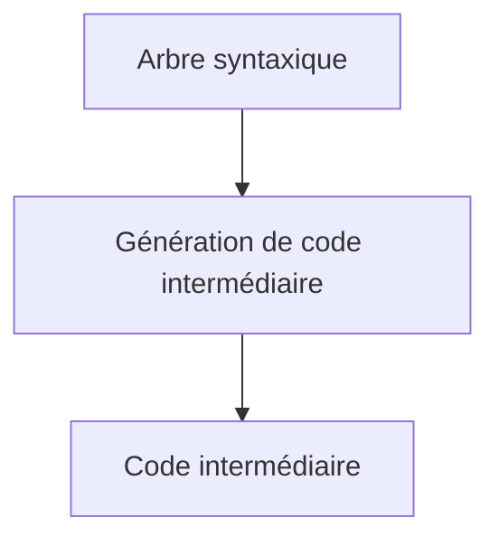

Le processus de génération de code intermédiaire se déroule en plusieurs étapes :

1. **Transformation de l'arbre syntaxique** : le compilateur transforme l'arbre syntaxique en une forme intermédiaire qui représente le code source sous une forme plus facile à manipuler.

2. **Optimisation du code intermédiaire** : le compilateur effectue des optimisations sur le code intermédiaire pour améliorer ses performances et sa taille.

3. **Génération de code intermédiaire** : le compilateur génère le code intermédiaire qui représente le code source sous une forme plus facile à manipuler pour les étapes suivantes du processus de compilation.

[🔝 Retour en haut de page](#table-des-matières)


## Optimisation du code

Une fois que le code intermédiaire est généré, le compilateur passe à l'étape d'optimisation du code. Cette étape consiste à améliorer la qualité et la performance du code en réorganisant le code intermédiaire de manière à réduire le nombre d'instructions nécessaires pour exécuter le programme.

Le schéma suivant illustre le processus d'optimisation du code :

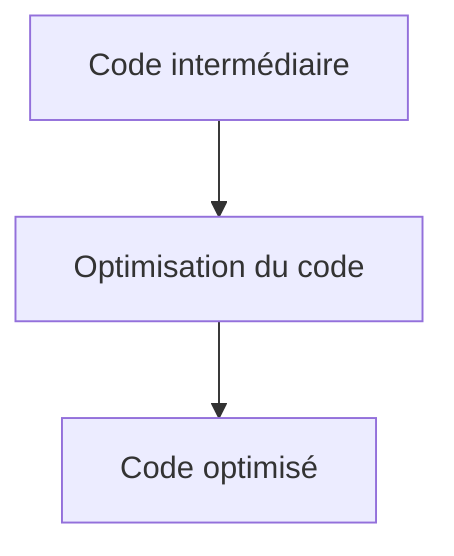

Le processus d'optimisation du code se déroule en plusieurs étapes :

1. **Analyse du code** : le compilateur analyse le code intermédiaire pour identifier les parties qui peuvent être optimisées.

2. **Application des optimisations** : le compilateur applique différentes techniques d'optimisation pour améliorer la qualité et la performance du code.

3. **Vérification de la validité** : le compilateur vérifie si les optimisations appliquées respectent les règles sémantiques et syntaxiques du langage de programmation.

4. **Génération du code optimisé** : le compilateur génère le code optimisé qui représente le code intermédiaire réorganisé de manière à améliorer la qualité et la performance du code.

[🔝 Retour en haut de page](#table-des-matières)


## Génération du code binaire

Une fois que le code intermédiaire est optimisé, le compilateur passe à l'étape de génération du code binaire. Cette étape consiste à générer le code binaire qui peut être exécuté par l'ordinateur.

Le schéma suivant illustre le processus de génération du code binaire :

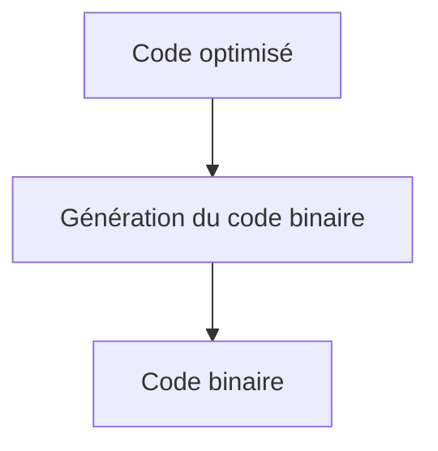

Le processus de génération du code binaire se déroule en plusieurs étapes :

1. **Allocation de la mémoire** : le compilateur alloue de la mémoire pour stocker le code binaire.

2. **Traduction du code optimisé** : le compilateur traduit le code optimisé en code binaire qui peut être exécuté par l'ordinateur.

3. **Liaison des bibliothèques** : le compilateur lie les bibliothèques nécessaires au code binaire pour qu'il puisse être exécuté.

4. **Génération du code binaire** : le compilateur génère le code binaire qui peut être exécuté par l'ordinateur.

[🔝 Retour en haut de page](#table-des-matières)

## Les compilateurs modernes

Les compilateurs modernes utilisent des techniques sophistiquées pour améliorer la performance et la qualité du code généré.

### Optimisation de la boucle

L'optimisation de la boucle consiste à transformer les boucles dans le code source en code binaire plus efficace en utilisant des techniques telles que la réorganisation des instructions, la réduction du nombre de tests de condition et l'exploitation des instructions SIMD (Single Instruction Multiple Data) pour effectuer des opérations en parallèle sur plusieurs données.

Voici un exemple de transformation de boucle utilisant l'optimisation de la boucle :

```c
// Boucle originale
for (int i = 0; i < n; i++) {
    a[i] = b[i] + c[i];
}

// Boucle optimisée
for (int i = 0; i < n; i += 4) {
    a[i] = b[i] + c[i];
    a[i+1] = b[i+1] + c[i+1];
    a[i+2] = b[i+2] + c[i+2];
    a[i+3] = b[i+3] + c[i+3];
}
```
#### Processus d'optimisation de la boucle
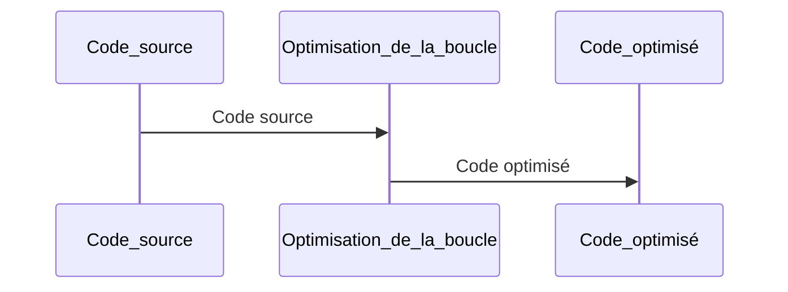

### Inlining de fonction

L'inlining de fonction consiste à insérer directement le code d'une fonction appelée à l'endroit où elle est utilisée, plutôt que de sauter à l'endroit où elle est définie. Cela permet d'éviter les coûts de l'appel de fonction, tels que la mise en place de la pile et la récupération des registres, et peut améliorer la performance du code.

#### Processus d'inlining de fonction
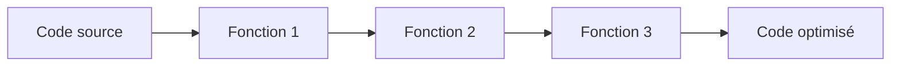
### Vectorisation

La vectorisation consiste à utiliser des instructions SIMD pour effectuer des opérations sur des vecteurs de données plutôt que sur des scalaires, ce qui peut améliorer considérablement la performance des boucles.

#### Processus de vectorisation

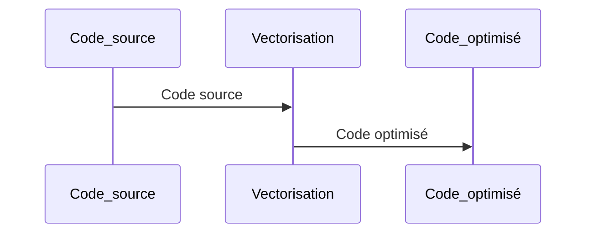

### Parallélisation

La parallélisation consiste à répartir les tâches sur plusieurs processeurs ou cœurs de processeur pour améliorer les performances. Cette technique est particulièrement utile pour les calculs intensifs tels que les simulations numériques et les rendus graphiques.

#### Processus de parallélisation :

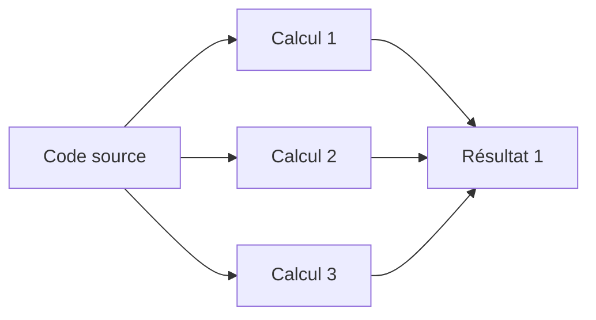

### Génération de profilage de code

La génération de profilage de code permet d'analyser les performances du code généré. Cette fonctionnalité permet aux développeurs de trouver des goulots d'étranglement dans leur code et d'optimiser les parties les plus critiques pour améliorer les performances globales.

#### Processus de génération de profilage de code :

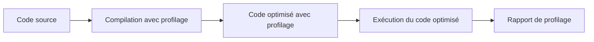

### Génération de code pour plusieurs langues de programmation

Certains compilateurs modernes sont capables de générer du code pour plusieurs langues de programmation. Cela permet aux développeurs de travailler dans leur langage de programmation préféré tout en bénéficiant des avantages d'un compilateur avancé.

#### Processus de génération de code pour plusieurs langues de programmation

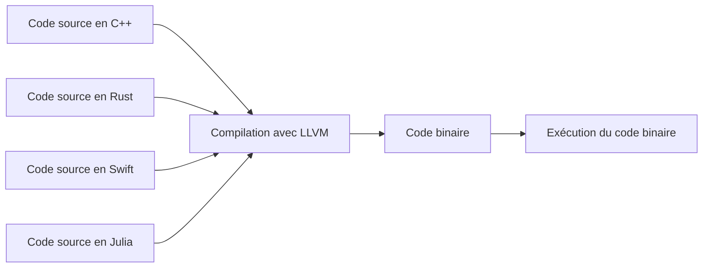

[🔝 Retour en haut de page](#table-des-matières)
